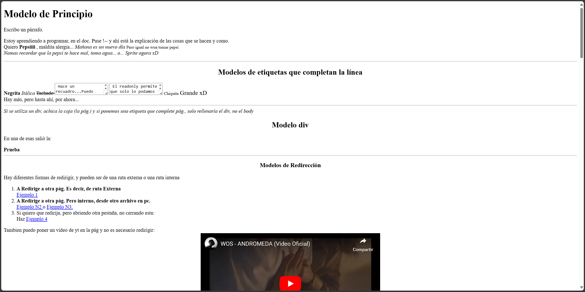

# Proyecto Introductorio de HTML

Este proyecto es un documento básico introductorio de HTML creado para demostrar varios elementos HTML y su uso. 
El documento incluye explicaciones y ejemplos de diferentes etiquetas HTML, atributos, integración multimedia, formularios, listas y más.
Un resumen del contenido y la estructura del documento HTML:

## Estructura del Proyecto

El proyecto consiste en un único archivo HTML con varias secciones para demostrar diferentes características de HTML. A continuación, se presenta un resumen de las secciones incluidas en el documento:

1. **Declaración del Tipo de Documento y Etiqueta HTML**: Declara el tipo de documento y define el elemento raíz.
2. **Sección Head**: Contiene meta información, incluyendo el conjunto de caracteres, palabras clave, descripción, autor, derechos de autor, robots y el título de la página.
3. **Sección Body**: Contiene el contenido visible de la página, incluyendo encabezados, párrafos, elementos multimedia, formularios, listas, tablas y más.

## Elementos y Atributos Clave de HTML

### Meta Información

- **Charset**: Especifica la codificación de caracteres para el documento.
- **Keywords**: Define palabras clave para los motores de búsqueda.
- **Description**: Proporciona una breve descripción de la página.
- **Author**: Indica el autor del documento.
- **Copyright**: Especifica la información de derechos de autor.
- **Robots**: Controla si los motores de búsqueda indexan la página y siguen los enlaces.

### Formateo de Texto

- **Encabezados (h1 a h6)**: Definen los encabezados del documento.
- **Párrafos (p)**: Definen párrafos de texto.
- **Estilos de Texto**: Incluye texto en negrita (b), cursiva (i), pequeño (small) y tachado (strike).

### Listas

- **Listas Desordenadas (ul)**: Crean listas con viñetas.
- **Listas Ordenadas (ol)**: Crean listas numeradas.

### Enlaces y Redirección

- **Etiquetas de Ancla (a)**: Crean hipervínculos a páginas externas e internas, con opciones para abrir en una nueva pestaña.
- **Videos Integrados (iframe)**: Integran videos de YouTube directamente en la página.

### Multimedia

- **Imágenes (img)**: Muestran imágenes de fuentes externas e internas, con atributos alt y title.
- **Videos (video)**: Incrustan archivos de video locales.
- **Audio (audio)**: Incrustan archivos de audio con controles.

### Formularios

- **Elementos de Formulario**: Incluyen varios tipos de entrada como texto, número, fecha, email, contraseña, color, rango, botón, enviar y resetear.
- **Textarea**: Proporciona un campo de entrada multilinea.

### Tablas

- **Elementos de Tabla**: Crean tablas con filas (tr) y celdas (td), incluyendo atributos de borde.

### Pie de Página

- **Etiqueta Footer (footer)**: Define el pie de página del documento con información del autor.

## Uso

Para ver el documento HTML, simplemente ábrelo en un navegador web. El documento está estructurado para proporcionar tanto explicaciones como ejemplos de varios elementos HTML, convirtiéndolo en un recurso útil para principiantes que están aprendiendo HTML.

## Licencia

Este proyecto está licenciado bajo la Licencia MIT. Consulta el archivo LICENSE para más detalles.

## Autor

Victoria Valentina Maidana Corti (VictoriaVMC)

## Muestra Visual

